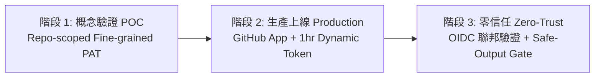

# 憑證安全性架構比較：PAT vs. GitHub App (Bonus 2)

在 GitHub Agentic Workflows 中，`approve-workflow-run` 需要具備 `actions:write` 與 `pull-requests:read` 的外部憑證。本文件深入比較 **Personal Access Token (Fine-Grained PAT)** 與 **GitHub App Installation Token** 在自動化核准閘門中的安全性與生命週期差異。

---

## 1. 核心維度對比總表

| 安全與維運維度 | Fine-Grained Personal Access Token (PAT) | GitHub App Installation Token | 最佳實踐建議 |
| :--- | :--- | :--- | :--- |
| **主體身分 (Identity)** | 綁定特定個人開發者帳號（User Context） | 獨立的機器人身分（Bot Context, 如 `app[bot]`） | **GitHub App 優**：避免員工離職導致自動化中斷。 |
| **權限範圍 (Scope)** | 可限縮至單一 Repository，但容易涵蓋個人可存取之其他資源 | 嚴格限縮至已安裝之 Repository 與明確宣告權限 | **GitHub App 優**：達成嚴格最小權限原則 (PoLP)。 |
| **生命週期 (Lifecycle)** | 靜態長期憑證（預設 30~365 天），過期需人工輪替 | **動態短期憑證（有效期 1 小時）**，隨用隨發 | **GitHub App 大勝**：即使 Token 外洩，影響視窗極短。 |
| **審計日誌 (Audit Trail)** | 顯示為個人帳號的操作紀錄，難以區分人為或 Agent 行為 | 稽核日誌明確顯示為 `github-actions[bot]` 或 App 名稱 | **GitHub App 優**：責任歸屬清晰，利於合規稽核。 |
| **撤銷機制 (Revocation)** | 撤銷將影響該 PAT 支援之所有自動化腳本 | 可隨時單獨卸載 App 或撤銷特定 Installation | **GitHub App 優**：粒度精細，不影響其他系統。 |
| **設定複雜度** | 簡單快速（GitHub 介面直接生成） | 需註冊 GitHub App、配置私鑰（Private Key）並簽發 JWT | **PAT 在 MVP/測試環境較快**。 |

---

## 2. 企業級安全架構演進路徑

1. **POC / 實驗階段 (本次 Challenge)**：
   - 使用 Repository-scoped Fine-Grained PAT，僅賦予目標 Repo 的 `actions:write` 與 `pull-requests:read`，存入 GitHub Actions Secret `APPROVE_WORKFLOW_RUN_TOKEN`。
2. **生產環境部署 (Production Hardening)**：
   - 註冊專屬的 GitHub App（例如 `Org-CI-Approval-Gate-Bot`）。
   - 在 Actions Runner 中透過 App ID 與 Private Key 即時換取 60 分鐘有效的臨時 Installation Token，根除靜態密鑰外洩風險。
